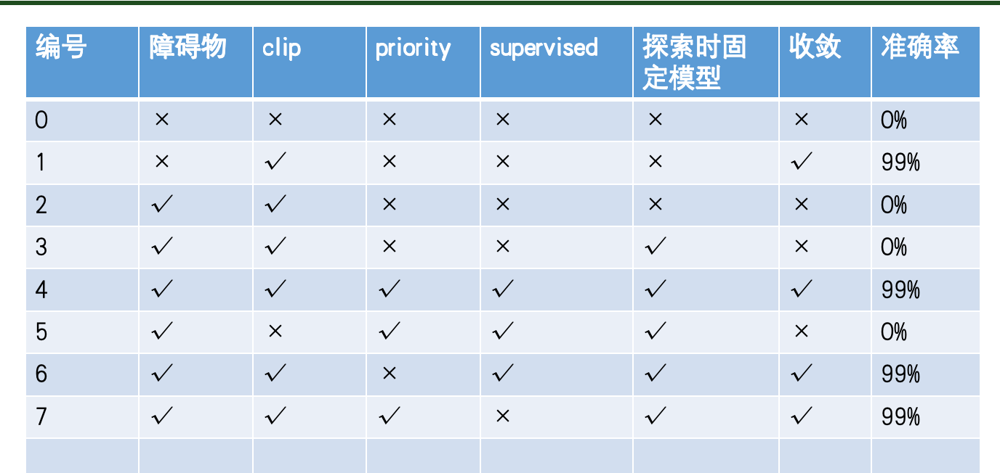
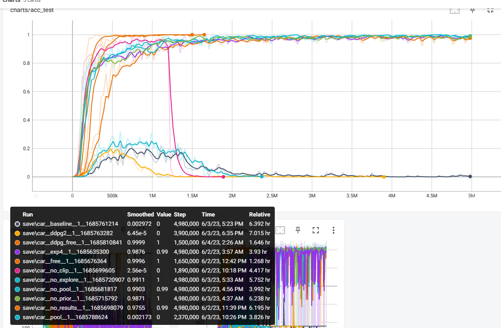

# RL-Obstacle-Avoidance-Car

这是我做的第一个强化学习的项目，由我自己设计任务场景和算法。作者：ZJEast

如果在线的README markdown 中的公式存在乱码，你可以选择渲染好的pdf版本 [pdf](./RL-Obstacle-Avoidance-Car.pdf)

## What is it?

任务中，要求四轮小车到达指定目标并保证自己不会与障碍物发生碰撞。目标用黄色三角形代表，障碍物用红色圆圈来控制。
读者可以下载视频 [2024-03-03 2016-01-32.mkv](./2024-03-03%2016-01-32.mkv) 来参看具体的任务场景，还有模型完成训练后的效果。


在制作这一任务的仿真环境时，主要参考了以下这些资料：

- OpenAI gym CarDynamics [https://github.com/openai/gym/blob/master/gym/envs/box2d/car_dynamics.py](https://github.com/openai/gym/blob/master/gym/envs/box2d/car_dynamics.py)

- OpenAI gym CarRacing [https://github.com/openai/gym/blob/master/gym/envs/box2d/car_racing.py](https://github.com/openai/gym/blob/master/gym/envs/box2d/car_racing.py)

- Box2D 教程 [http://www.iforce2d.net/b2dtut/](http://www.iforce2d.net/b2dtut/)

- 四轮小车动力学分析 [http://www.iforce2d.net/b2dtut/top-down-car](http://www.iforce2d.net/b2dtut/top-down-car)

- Planar Geometric Library "shapely" [https://github.com/shapely/shapely](https://github.com/shapely/shapely)

在OpenAI gym CarRacing任务的基础上进行修改，删除了原有的赛道，修改了状态观察，添加了目标和障碍物的代码实现。
对于修改后的状态观察，读者可以跳到 [./env/move_to_pose.py#L241](./env/move_to_pose.py#L241) 了解更多，它们包括但不限于

``` python

    def _base_state(self):
        v = np.array(self.car.hull.linearVelocity)
        true_speed = np.linalg.norm(v)
        state = np.array([
            true_speed,
            self.car.wheels[0].omega,
            self.car.wheels[1].omega,
            self.car.wheels[2].omega,
            self.car.wheels[3].omega,
            self.car.wheels[0].joint.angle,
            self.car.hull.angularVelocity,
        ])
        return state

```

分别代表车身的线速度、四轮各自的速度，前轮角度，车身的角速度等。除此以外，还有小车对于障碍物和目标的观察，在此不列举了。

当小车达到目标时（包括方向正确），会获得500分的奖励；当小车与障碍物发生碰撞时，获得-500分。这是一个稀疏奖励的任务。

## How it works?

对于这一个基础的经典的控制问题，人们提出过非常多方法和思路。然而对于这样的问题结合具体运动学模型来求解精确解可能是困难的，结合最优化理论来对机器人进行运动规划恐怕也是不切实际的，因为这样的问题往往不具备凸性，以至于不得不做一些简化的处理，否则无法保证计算的高效性。

近年来，强化学习在新一轮AI浪潮中也得到了发展。在这篇工作中，我们提议可以尝试深度强化学习来解决这一问题。我们参考的工作有：

- CleanRL [https://github.com/vwxyzjn/cleanrl](https://github.com/vwxyzjn/cleanrl)

- Stable Baselines 3 [https://github.com/DLR-RM/stable-baselines3](https://github.com/DLR-RM/stable-baselines3)

- DDPG [https://arxiv.org/abs/1509.02971](https://arxiv.org/abs/1509.02971)

- TD3 [https://arxiv.org/abs/1802.09477](https://arxiv.org/abs/1802.09477)

- Hindsight Experience Replay [https://arxiv.org/abs/1707.01495](https://arxiv.org/abs/1707.01495)

- Prioritized Experience Replay [https://arxiv.org/abs/1511.05952v4](https://arxiv.org/abs/1511.05952v4)

然而，直接把前人的模型拿过来恐怕还不能直接解决这个问题，我们必须再做一些额外的工作。

### 收敛性和鲁棒性

稀疏奖励对于模型的收敛性提出了较大的挑战，特别是同时存在高额奖励和高额惩罚。我们需要再这一小节来介绍我们如何克服这些挑战和困难的。

如果我们将需要被拟合的 $Q$ 值记为 $y_t$ ，一般而言有， $y_t = r_t + \gamma \min_{i=1,2} Q^{\prime}(s_{t+1}, \pi^{\prime}(s_{t+1}))$ 。

我们希望对 $y_t$ 进行一些处理来增加模型的鲁棒性。具体而言，我们做了以下这些步骤：

- 令 $y^{\prime}_t = \max (y_t, \sum^{\infty}_{i=t} \gamma^{i - t} r_i)$，我们认为使用$y^{\prime}_t$可以有效避免agent过于悲观，可以加速模型的训练。

- 令 $y^{\prime \prime}_t = Q(s_t, a_t) + \left[ y^{\prime}_t -  Q(s_t, a_t)  \right]^{+\epsilon}_{-\epsilon}$ ，我们认为这样的 $y^{\prime \prime}_t$ 可以将MSE loss控制在一个合理的范围 $[-\epsilon, +\epsilon] 之中$，这样做可以有效增强模型在训练过程的鲁棒性，避免模型坍塌或者不收敛。在别的一些强化学习的工作中，通常称这样的处理为"reward clip"。

- 最后的损失函数的梯度当然就是 $\triangledown_{\theta}L_{critic} = \triangledown_Q (y^{\prime \prime}_t - Q(s_t, a_t))^2 \triangledown_{\theta} Q(s_t, a_t)$ ,如果我们以$\theta$来表示$Q$网络参数的话。

### Prioritized Experience Replay

"reward clip"对于我们这个任务的收敛性起到了非常关键的作用，配合Prioritized Experience Replay一起使用，可以起到更好的效果。我们实现Prioritized Replay Buffer的方式可能与原论文有所不同，具体而言

- 我们会记录 Replay Buffer 中的每个样本对应的 $|y_t - Q(s_t, a_t)|$ ，作为该样本的Priority，也就是优先级

- 当 Replay Buffer 没有满时，直接将当前的transition元组加到里面去

- 当 Replay Buffer 满了，我们首先从Replay Buffer中抽取128个样本，并找出里面优先级最低的样本，并将新的样本代替掉这个优先级最低的样本。

- 每个新样本刚进入Replay Buffer时，它的优先级会被设置为无穷大，直至它被输入到网络中进行训练，它的优先级才会得到更新。

### Exploration & Hindsight Experience Replay

Hindsight Experience Replay （HER） 依然是强化学习领域应对稀疏奖励的最主要的方法。然而只有HER可能还不足以解决我们这个问题。这是因为HER中主要讨论的是goal-based 的强化学习的问题，而我们的任务中除了目标之外还有障碍物的存在，因此我们不得不在HER的基础上进行一些扩展。我们做了以下这些事情

- 我们首先只考虑没有障碍物的情况，这时，我们可以直接应用HER来对模型进行训练，将这个不考虑障碍物的模型称作agent1，agent1是非常容易训练和收敛的。

- 我们把考虑了障碍物的模型称作agent2，相比于agent1，agent2的训练困难很多，agent2也可以使用HER，当agent2从HER的机制中学到的东西可能是有限的，除此以外，还需要我们提供切实有效的探索机制

对于一个具体的随机生成的目标（goal）和障碍物（obstacle）而言，我们提出这样的探索机制

- 如果agent2可以控制小车直接到达目标并没有发生碰撞，则直接将这个episode的轨迹数据存到Replay Buffer中即可

- 如果agent2无法到达目标，或者发生了碰撞，那么我们尝试直接使用agent1来从初始位置驶向目标，如果agent1的行为是可行的话，那么把agent1所生成的轨迹数据作为示范数据存到Replay Buffer

- 如果agent2和agent1都无法直接到达目标的话，此时我们生成一个随机子目标$g_{sub}$，然后我们尝试使用agent1驾驶到$g_{sub}$，然后过了一段时间后，我们再尝试切换回agent2驾驶向原来的目标$g$。这个过程由agent1和agent2共同协作来完成。这个过程我们可能会重复有限次，直至能够探索出切实可行的方案。

在应用了前面我们提到所有的方法之后，我们就可以训练出非常好的模型

## 消融实验





最终，最好的模型我们认为是"no_pool.py" 和 "no_pool.ipynb" 这组实验，也就是上面我们花了大篇幅叙述的版本。

或者查看由我编写的研究生中期报告的ppt [ppt](./人工智能学院2023年研究生中期考核答辩PPT.pptx)

## 代码 & 复现实验

我的代码实现可能相对凌乱，如果你希望复习我的实验，可以从下面几点开始进行

- "env"目录下放置了我所改写的仿真环境

- "environment.yaml"是我的电脑所到处的conda环境的配置

- "no_pool.ipynb"中第一个代码块用了import一些依赖，第二个代码块用来开始训练，第三个代码块用来enjoy训练好的模型。

最后我们训练出来的模型对于随机任务的成功率高于99%以上，因此我们认为该模型基本上完成了该任务。
