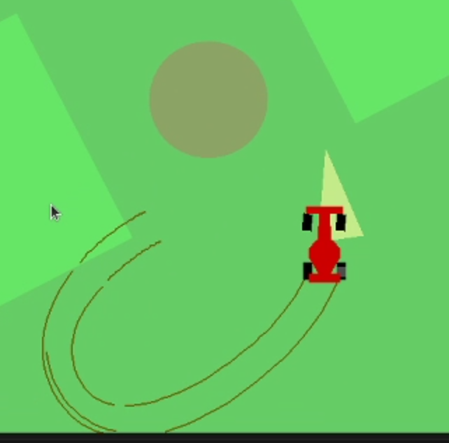

# RL-Obstacle-Avoidance-Car

这是我做的第一个强化学习的项目，由我自己设计任务场景和算法。作者：ZJEast

## What is it?

任务中，要求四轮小车到达指定目标并保证自己不会与障碍物发生碰撞。目标用黄色三角形代表，障碍物用红色圆圈来控制。
读者可以下载视频 [2024-03-03 2016-01-32.mkv](./2024-03-03%2016-01-32.mkv) 来参看具体的任务场景，还有模型完成训练后的效果。



在制作这一任务的仿真环境时，主要参考了以下这些资料：

- OpenAI gym CarDynamics [https://github.com/openai/gym/blob/master/gym/envs/box2d/car_dynamics.py](https://github.com/openai/gym/blob/master/gym/envs/box2d/car_dynamics.py)

- OpenAI gym CarRacing [https://github.com/openai/gym/blob/master/gym/envs/box2d/car_racing.py](https://github.com/openai/gym/blob/master/gym/envs/box2d/car_racing.py)

- Box2D 教程 [http://www.iforce2d.net/b2dtut/](http://www.iforce2d.net/b2dtut/)

- 四轮小车动力学分析 [http://www.iforce2d.net/b2dtut/top-down-car](http://www.iforce2d.net/b2dtut/top-down-car)

- Planar Geometric Library "shapely" [https://github.com/shapely/shapely](https://github.com/shapely/shapely)

在OpenAI gym CarRacing任务的基础上进行修改，删除了原有的赛道，修改了状态观察，添加了目标和障碍物的代码实现。
对于修改后的状态观察，读者可以到 [./env/move_to_pose.py#L241](./env/move_to_pose.py#L241) 了解更多，它们包含但不限于

``` python

    def _base_state(self):
        v = np.array(self.car.hull.linearVelocity)
        true_speed = np.linalg.norm(v)
        state = np.array([
            true_speed,
            self.car.wheels[0].omega,
            self.car.wheels[1].omega,
            self.car.wheels[2].omega,
            self.car.wheels[3].omega,
            self.car.wheels[0].joint.angle,
            self.car.hull.angularVelocity,
        ])
        return state

```

分别代表速度、四轮各自的速度，前轮角度，车身的角速度等。

## How it works?
